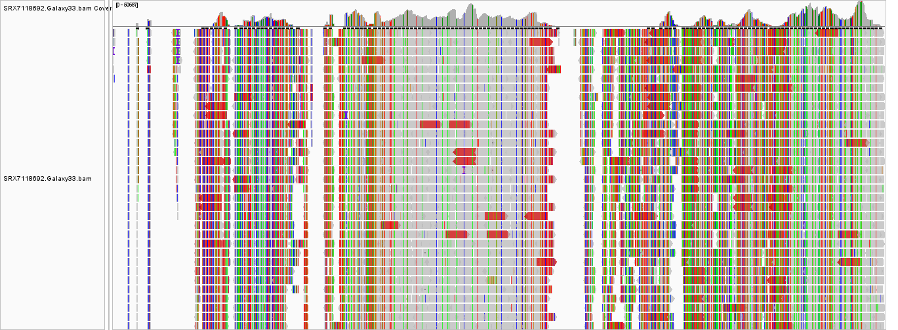

# NGS-data-analysis

# RNA-seq Analysis of Bean Yellow Mosaic Virus(BYMV), SRX7118692

  
  

**Reproducible end-to-end RNA-seq pipeline on public viral dataset using Galaxy platform**

## Overview
"SRX7118692" is a paired-end RNA-seq dataset of Bean yellow mosaic virus(BYMV), a potyvirus infecting legumes like lentil. The sequencing was performed on Illumina MiSeq platform in a single run, generating ~1.8 million spots (~3.57 million reads, 469.6M bases).  

This project is a self-directed portfolio demonstrating my bioinformatics skills as a recent BSc graduate in Cellular and Molecular Biology transitioning to MSc in Bioinformatics. I performed quality control, preprocessing, reference-based mapping, variant calling (low and high-frequency), consensus genome reconstruction, and de novo assembly/validation all in **Galaxy (usegalaxy.org)** for full reproducibility.

Key goals:  
- Assess data quality and handle real-world issues (e.g., low mapping rate)  
- Map reads to BYMV reference and detect variants 
- Reconstruct consensus genome and validate with de novo assembly

## Data Source
- **NCBI SRA Accession**: [SRX7118692](https://www.ncbi.nlm.nih.gov/sra/SRX7118692) (Run: SRR10420664)  
- **Library Strategy**: RNA-Seq  
- **Platform**: Illumina MiSeq, paired-end  
- **Spots/Reads**: 1,794,367 spots (~3.57 million reads)  
- **Study**: RNA-Seq of BYMV 
## Reference Genome
**Reference Genome used for alignment**:
- Accession: NC_003492.1
- Source: NCBI Nucleotide database
- Direct link: [https://www.ncbi.nlm.nih.gov/nuccore/NC_003492.1/](https://www.ncbi.nlm.nih.gov/nuccore/NC_003492.1)

## Analysis Pipeline

All steps performed on usegalaxy.org

### 1. Quality Control 
Tool: **FastQC**  
- Evaluated per-base sequence quality, GC content, duplication levels, overrepresented sequences, adapter content  
- Observations:  
    - Per sequence GC content **failed** (bimodal peaks which can be due to contamination in samples)
    -  Sequence Duplication Levels **failed** caused by dominant host rRNA (due to incomplete depletion) and low viral RNA load
    - Per base sequence content showed fluctuations in early positions (normal for RNA-seq due to random priming)
  - Other metrics passed → data acceptable for downstream analysis despite issues

### 2. Trimming & Adapter Removal
Tool: **Trim Galore!** 
- Removed adapters, low-quality bases (Phred QS<20), reads with Ns
- Post-trimming QC: Re-ran FastQC + **MultiQC** for aggregated report 
- Improvements: Mean quality score significantly increased; adapter content dropped dramatically while duplication levels remained intact (duplication in RNA-seq is predominantly biological while trimming removes technical artifacts)  

### 3. Read Alignment
Tool: **BWA-MEM2**  
-  Downloaded/used in Galaxy: FASTA file imported directly for BWA-MEM2 alignment
- Mapped trimmed paired-end reads to BYMV reference genome
- Output: BAM file which should be transformed to SAM for interpretation. This is done by Samtools view.

2. Alignment statistics
Tool: **samtools flagstat**   
   Results:  
   - Total reads: 3,570,349 (paired-end)  
   - Mapped: 952,661 (26.68%)  
   - Properly paired: 947,068 (26.53%)  
   - Low mapping rate likely due to rRNA contamination 

3. Mapping visualization
Tool: **IGV** 
 -results indicate numerous variations (due to mutation-prone nature of viral genome)
 

4. Removing Duplicates
Tool: **samtools markdup**  
   Marked and removed duplicates and low-quality reads (EXCLUDED: 2618567)  
   Results:
   - EXAMINED: 951782
   - PAIRED: 951010
   - DUPLICATE TOTAL: 660375
   Reduced bias in variant frequency estimates.  

### 4. SNP calling 
1. Realign reads 
Tool: **LoFreq viterbi**  
   Correct misalignments around insertions and deletions (indels) that might have occurred during the initial alignment.

2. Add LoFreq alignment quality scores  
     Add Indel Qualities with LoFreq Insert Indel Qualities
     Incorporate indel quality scores into the alignment file.

3. call variants with LoFreq
     Identify and call variants, including single nucleotide variants (SNVs) and indels
     based on the realigned reads and the indel qualities
     Some Base-calling quality defaults were changed:
     - Minimum baseQ = 20
     - Minimum BaseQ for alternate bases = 20
     - Minimum mapping quality = 20
      
     
2'. **samtools mpileup**  
   Created pileup file (position-wise base/quality summary).  
   Input for VarScan 

3'. **VarScan mpileup**  
   Called high-frequency SNPs and indels  
   Suitable for consensus-level variants  

4. Visualization
Tool: **IGV & Venn Diagram** 
  visualizing results from SNP calling using IGV

  indicating overlaps between the two results from mpileup and LoFreq using Venn Diagram

 
5. **SnpSift**  
    Filtered "position" field from VarScan mpileup output for drawing Venn Diagram.

  
### Assembly   
1. Reference-based assembly
Tool: **bcftools consensus**  
    Generated consensus genome by applying variants to reference FASTA
    

2. De novo assembly
Tool: **SPAdes**  
    De novo assembly of trimmed reads (likely metaSPAdes or virus mode).
